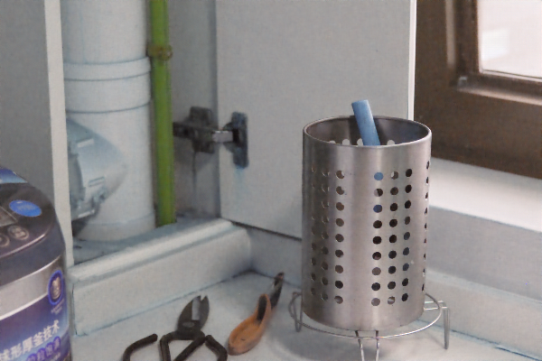

<h2 style="text-align:center;">Retinexformer (default)</h2>

C++ (Windows, Linux, MacOS / CUDA and Metal accelerated) port of [https://github.com/caiyuanhao1998/Retinexformer.git](https://github.com/caiyuanhao1998/Retinexformer.git).

### Example Input & Outputs
| Inputs | Outputs |
|--------|----------|
|  Input |  Result |

### Demo Code
```cpp
#include <opencv2/opencv.hpp>

#include "blace_ai.h"

// include the models you want to use
#include "retinexformer_v1_default_v1_ALL_export_version_v26.h"

using namespace blace;
int main() {
  ::workload_management::BlaceWorld blace;
  // load image into op
  auto exe_path = util::getPathToExe();
  std::filesystem::path photo_path = exe_path / "dark_kitchen.png";
  auto input_img = CONSTRUCT_OP(ops::FromImageFileOp(photo_path.string()));

  // construct model inference arguments
  ml_core::InferenceArgsCollection infer_args;
  infer_args.inference_args.backends = {
      ml_core::TORCHSCRIPT_CUDA_FP16, ml_core::TORCHSCRIPT_MPS_FP16,
      ml_core::TORCHSCRIPT_CUDA_FP32, ml_core::TORCHSCRIPT_MPS_FP32,
      ml_core::ONNX_DML_FP32,         ml_core::TORCHSCRIPT_CPU_FP32};

  // construct inference operation
  auto infer_op = retinexformer_v1_default_v1_ALL_export_version_v26_run(
      input_img, 0, infer_args, util::getPathToExe().string());

  // construct evaluator and evaluate to cv::Mat
  computation_graph::GraphEvaluator evaluator(infer_op);
  auto [return_code, cv_result] = evaluator.evaluateToCVMat();

  // multiply for plotting
  cv_result *= 255.;

  // save to disk and return
  auto out_file = exe_path / "illuminated_kitchen.png";
  cv::imwrite(out_file.string(), cv_result);

  return 0;
}

```
Tested on version [v1.0.5](https://github.com/blace-ai/blace-ai/releases/tag/v1.0.5) of blace.ai sdk. Might also work on newer or older releases (check if release notes of blace.ai state breaking changes).

### Quickstart
1. Download [blace.ai SDK](https://github.com/blace-ai/blace-ai/releases/tag/v1.0.5) and unzip. In the bootstrap script `build_run_demos.ps1` (Windows) or `build_run_demos.sh` (Linux/MacOS) set the `BLACE_AI_CMAKE_DIR` environment variable to the `cmake` folder inside the unzipped SDK, e.g. `export BLACE_AI_CMAKE_DIR="<unzip_folder>/package/cmake"`. 
2. Download the model payload(s) (`.bin` files) from below and place in the same folder as the bootstrapper scripts.
3. Then run the bootstrap script with  
`powershell build_run_demo.ps1` (Windows)  
`sh build_run_demo.sh` (Linux and MacOS).  
This will build and execute the demo.

### Supported Backends
<table border="0" cellspacing="0" cellpadding="0" border-style="hidden" style="width:100%; text-align:center;">
 <thead>
    <tr>
      <th>Torchscript CPU</th>
      <th>Torchscript CUDA FP16 *</th>
      <th>Torchscript CUDA FP32 *</th>
      <th>Torchscript MPS FP16 *</th>
      <th>Torchscript MPS FP32 *</th>
      <th>ONNX CPU FP32</th>
      <th>ONNX DirectML FP32 *</th>
    </tr>
  </thead>
 <tr>
    <td>&#9989</td>
    <td>&#9989</td>
    <td>&#9989</td>
    <td>&#9989</td>
    <td>&#9989</td>
    <td>&#10060</td>
    <td>&#10060</td>
</table>
(*: Hardware Accelerated)

### Artifacts
| [**Torchscript Payload**](https://blace-ai-public.b-cdn.net/model-payload/91116374d75b2a4c2da7bd0be7d35f81.bin) |  | [**Demo Project**](https://blace-ai-public.b-cdn.net/demos/retinexformer_v1_default_v1_ALL_export_version_v26_demo.zip) | [**Header**](https://blace-ai-public.b-cdn.net/model-defs/retinexformer_v1_default_v1_ALL_export_version_v26.h) |
|--------------------------------------------------------|---------------------|------------------------------------|------------------------------|
          

### [License](https://github.com/caiyuanhao1998/Retinexformer/blob/master/LICENSE.txt)
