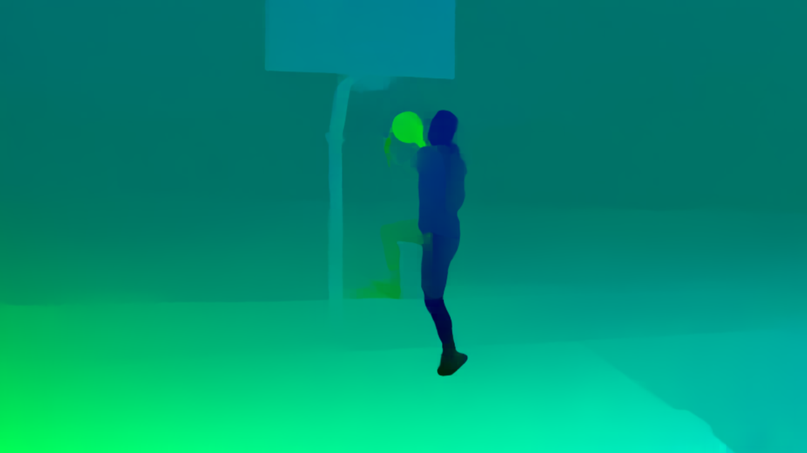

<h2 style="text-align:center;">Raft (default)</h2>

C++ (Windows, Linux, MacOS / CUDA and Metal accelerated) port of [RAFT](https://github.com/princeton-vl/RAFT).

### Example Input & Outputs
| Inputs | Outputs |
|--------|----------|
|  Frame 0 Frame 1 |  Normalized Optical Flow |

### Demo Code
```cpp
#include "blace_ai.h"
#include <opencv2/opencv.hpp>

// include the models you want to use
#include "raft_v1_default_v2_ALL_export_version_v26.h"

using namespace blace;

std::shared_ptr<RawMemoryObject> memory_from_file(std::string file) {
  // read image into memory
  cv::Mat image = cv::imread(file, cv::IMREAD_COLOR);

  // construct a hash from the filename
  ml_core::BlaceHash random_hash(file);

  // construct the memory object. We set copy_memory to true, since image will
  // be out-of-scope upon method return and therefore we need to take ownership
  // of the data
  RawMemoryObject raw_mem((void *)image.data, ml_core::DataTypeEnum::BLACE_BYTE,
                          ml_core::ColorFormatEnum::BGR,
                          std::vector<int64_t>{1, image.rows, image.cols, 3},
                          ml_core::BHWC, ml_core::ZERO_TO_255, ml_core::CPU,
                          random_hash, true);

  return std::make_shared<RawMemoryObject>(raw_mem);
}

int main() {
  ::workload_management::BlaceWorld blace;
  // load image into op
  auto exe_path = util::getPathToExe();
  std::filesystem::path frame_0 = exe_path / "raft_frame_0.png";
  std::filesystem::path frame_1 = exe_path / "raft_frame_1.png";

  auto frame_0_mem = memory_from_file(frame_0.string());
  auto frame_1_mem = memory_from_file(frame_1.string());

  auto frame_0_op = CONSTRUCT_OP(ops::FromRawMemoryOp(frame_0_mem));
  auto frame_1_op = CONSTRUCT_OP(ops::FromRawMemoryOp(frame_1_mem));

  auto num_flow_updates = CONSTRUCT_OP(ops::FromIntOp(12));

  // construct model inference arguments
  ml_core::InferenceArgsCollection infer_args;
  infer_args.inference_args.backends = {
      ml_core::TORCHSCRIPT_CUDA_FP16, ml_core::TORCHSCRIPT_MPS_FP16,
      ml_core::TORCHSCRIPT_CUDA_FP32, ml_core::TORCHSCRIPT_MPS_FP32,
      ml_core::ONNX_DML_FP32,         ml_core::TORCHSCRIPT_CPU_FP32};

  // construct inference operation
  auto infer_op = raft_v1_default_v2_ALL_export_version_v26_run(
      frame_0_op, frame_1_op, num_flow_updates, 0, infer_args,
      util::getPathToExe().string());

  // normalize optical flow to zero-one range for plotting. The model returns
  // relative offsets in -1 to 1 pixel space, so the raw values are to small to
  // plot
  infer_op = CONSTRUCT_OP(ops::NormalizeToZeroOneOP(infer_op));

  // convert uv color to rgb (by U->R, V->G, 1->B)
  infer_op = CONSTRUCT_OP(ops::ToColorOp(infer_op, ml_core::RGB));

  // we prepare the result for later copy to cv::Mat. The values set here are
  // based on implicit knowledge of cv::Mat internal data storage.
  auto normalized_matte = CONSTRUCT_OP(ops::PrepareForHostCopyOP(
      infer_op, ml_core::BLACE_BYTE, ml_core::RGB, ml_core::HWC,
      ml_core::ZERO_TO_255, ml_core::CPU));

  // construct evaluator and evaluate to raw memory object
  computation_graph::GraphEvaluator evaluator(normalized_matte);
  auto [return_code, raw_mem] = evaluator.evaluateToRawMemory();

  // get the sizes
  int w = raw_mem->get_memory_sizes()[1];
  int h = raw_mem->get_memory_sizes()[0];

  // initialize an empty cv::Mat
  cv::Mat cv_mat(h, w, CV_8UC3);
  cv_mat.setTo(cv::Scalar(0, 0, 0));

  // and copy the memory
  std::memcpy(cv_mat.data, raw_mem->get_data_ptr(), raw_mem->get_memory_size());

  // save to disk and return
  auto out_file = exe_path / "optical_flow.png";
  cv::imwrite(out_file.string(), cv_mat);

  return 0;
}

```
Tested on version [v1.0.5](https://github.com/blace-ai/blace-ai/releases/tag/v1.0.5) of blace.ai sdk. Might also work on newer or older releases (check if release notes of blace.ai state breaking changes).

### Quickstart
1. Download [blace.ai SDK](https://github.com/blace-ai/blace-ai/releases/tag/v1.0.5) and unzip. In the bootstrap script `build_run_demos.ps1` (Windows) or `build_run_demos.sh` (Linux/MacOS) set the `BLACE_AI_CMAKE_DIR` environment variable to the `cmake` folder inside the unzipped SDK, e.g. `export BLACE_AI_CMAKE_DIR="<unzip_folder>/package/cmake"`. 
2. Download the model payload(s) (`.bin` files) from below and place in the same folder as the bootstrapper scripts.
3. Then run the bootstrap script with  
`powershell build_run_demo.ps1` (Windows)  
`sh build_run_demo.sh` (Linux and MacOS).  
This will build and execute the demo.

### Supported Backends
<table border="0" cellspacing="0" cellpadding="0" border-style="hidden" style="width:100%; text-align:center;">
 <thead>
    <tr>
      <th>Torchscript CPU</th>
      <th>Torchscript CUDA FP16 *</th>
      <th>Torchscript CUDA FP32 *</th>
      <th>Torchscript MPS FP16 *</th>
      <th>Torchscript MPS FP32 *</th>
      <th>ONNX CPU FP32</th>
      <th>ONNX DirectML FP32 *</th>
    </tr>
  </thead>
 <tr>
    <td>&#9989</td>
    <td>&#10060</td>
    <td>&#9989</td>
    <td>&#10060</td>
    <td>&#9989</td>
    <td>&#10060</td>
    <td>&#10060</td>
</table>
(*: Hardware Accelerated)

### Artifacts
| [**Torchscript Payload**](https://blace-ai-public.b-cdn.net/model-payload/eeb66794e9f254b7d394fbd39545b483.bin) |  | [**Demo Project**](https://blace-ai-public.b-cdn.net/demos/raft_v1_default_v2_ALL_export_version_v26_demo.zip) | [**Header**](https://blace-ai-public.b-cdn.net/model-defs/raft_v1_default_v2_ALL_export_version_v26.h) |
|--------------------------------------------------------|---------------------|------------------------------------|------------------------------|
          

### [License](https://github.com/pytorch/vision/blob/main/LICENSE)
