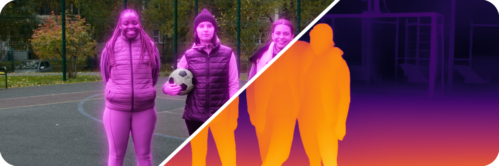

A curated collection of ready-to-use AI models compatible with the [blace.ai inference SDK](https://github.com/blace-ai/blace-ai).

# 🌟 Highlight Models
**Segment Anything 3 — Image Segmentation** 👉 [Model Card](https://github.com/blace-ai/hub/tree/main/Image%20Segmentation/sam3-default-ALL)  
**Depth Anything 2 — Depth Estimation** 👉 [Model Card](https://github.com/blace-ai/hub/tree/main/Depth%20Estimation/depth_anything_v2-small-ALL)  
**Memfof — Optical Flow** 👉 [Model Card](https://github.com/blace-ai/hub/tree/main/Optical%20Flow%20Estimation/memfof-default-ALL)

# Available Models
| Model | Configuration | Category | Link |
| -------- | ------- | ----- | ------ |
| **Distillanydepth** | default | Depth Estimation | [Model Card](https://github.com/blace-ai/hub/tree/main/Depth%20Estimation/DistillAnyDepth-default-ALL) |
| **Distillanydepth** | small | Depth Estimation | [Model Card](https://github.com/blace-ai/hub/tree/main/Depth%20Estimation/DistillAnyDepth-small-ALL) |
| **Distillanydepth** | large | Depth Estimation | [Model Card](https://github.com/blace-ai/hub/tree/main/Depth%20Estimation/DistillAnyDepth-large-ALL) |
| **BEN2** | default | Human Matting | [Model Card](https://github.com/blace-ai/hub/tree/main/Human%20Matting/ben2-default-ALL) |
| **Coordfill** | default | Image Inpainting | [Model Card](https://github.com/blace-ai/hub/tree/main/Image%20Inpainting/coordfill-default-ALL) |
| **Depth Anything V2** | small | Depth Estimation | [Model Card](https://github.com/blace-ai/hub/tree/main/Depth%20Estimation/depth_anything_v2-small-ALL) |
| **Depth Anything 3** | metric_large | Depth Estimation | [Model Card](https://github.com/blace-ai/hub/tree/main/Depth%20Estimation/depth_anything_v3-metric_large-ALL) |
| **Depth Anything 3** | mono_large | Depth Estimation | [Model Card](https://github.com/blace-ai/hub/tree/main/Depth%20Estimation/depth_anything_v3-mono_large-ALL) |
| **Gemma** | 2b-v2 | LLM | [Model Card](https://github.com/blace-ai/hub/tree/main/LLM/gemma-2b-v2-ALL) |
| **Llmdet** | default | Open-Vocabulary Object Detection | [Model Card](https://github.com/blace-ai/hub/tree/main/Open-Vocabulary%20Object%20Detection/llmdet-default-ALL) |
| **Memfof** | default | Optical Flow Estimation | [Model Card](https://github.com/blace-ai/hub/tree/main/Optical%20Flow%20Estimation/memfof-default-ALL) |
| **Raft** | default | Optical Flow Estimation | [Model Card](https://github.com/blace-ai/hub/tree/main/Optical%20Flow%20Estimation/raft-default-ALL) |
| **Retinexformer** | default | Low Light Image Enhancement | [Model Card](https://github.com/blace-ai/hub/tree/main/Low%20Light%20Image%20Enhancement/retinexformer-default-ALL) |
| **Segment Anything 3** | default | Image Segmentation | [Model Card](https://github.com/blace-ai/hub/tree/main/Image%20Segmentation/sam3-default-ALL) |
| **Semantic Guided Human Matting** | default | Human Matting | [Model Card](https://github.com/blace-ai/hub/tree/main/Human%20Matting/sghm-default-ALL) |
| **Videoflow** | default | Optical Flow Estimation | [Model Card](https://github.com/blace-ai/hub/tree/main/Optical%20Flow%20Estimation/videoflow-default-ALL) |
  
  
# Why blace.ai models?

Our hub is designed for developers who want cross-platform, plug-and-play AI in their native C++ applications with minimal setup. Model features:

- ✅ Can be included with a few lines of code
- ✅ Continuously tested across supported devices and backends
- ✅ Self-contained — no Python required
- ✅ Ship with easy-to-use demos
- ✅ Hardware-Accelerated on CUDA, MPS and DirectML

# Custom models
You can make your custom **Torchscript** and **ONNX** models compatible with the blace.ai runtime ([Documentation](https://blace-ai.github.io/blace-ai/model_wizard_creation.html)).

# Searchable Database
A searchable database of all models is available under [https://blace.ai/hub](https://blace.ai/hub).